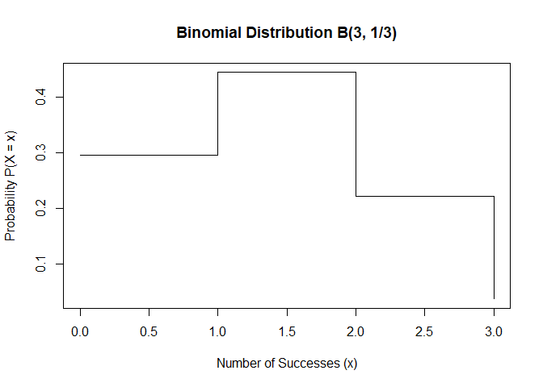

# url: your book url like https://bookdown.org/yihui/bookdown

Placeholder


<!--chapter:end:index.Rmd-->

# Author  {-}

My name is Kyungmin In, and I am the head of the Research Unit at **GCCL** (https://eng.gccl.co.kr/).I have worked as a bioanalytical team leader for many years at several companies. My academic background includes a Ph.D. in molecular biology, with additional studies in immunology. During my Ph.D. in Germany, I focused on researching rare genetic diseases. I am particularly interested in automation and reproducible data generation and analysis for bioanalysis, which has led me to explore tools like **R**. Additionally, I have experience using commercial systems like **Watson LIMS** (Thermo Fisher Scientific) for efficient data management and analysis, in line with the company's goals."


<!--chapter:end:00-Authour.Rmd-->


# Chapter 1: Bernoulli Trial {.unnumbered}

Placeholder


<!--chapter:end:01-BernoulliTrial.Rmd-->

# Chapter 2: Binomial Distribution {.unnumbered}

A binomial distribution describes the number of successes in a fixed number of independent Bernoulli trials, each with the same probability of success $p$.

We write: 
$$
X \sim B(n, p)
$$

where:

-   $n$ is the number of trials (e.g., number of droplets in ddPCR),

-   $p$ is the probability of success in each trial,

-   $X$ is the number of successful trials (positive droplets).

**Example**

Let’s consider a simple example using dice. Suppose we roll a die 3 times and count how many times we get a multiple of 3 (i.e., 3 or 6).

This is a Bernoulli trial repeated 3 times, with:

$$
p = \frac{2}{6} = \frac{1}{3}, \quad n = 3
$$

We are interested in the distribution of $X$ = number of successes (i.e., times we get a 3 or 6).

The binomial probability mass function is:

$$
P(X = x) = \binom{n}{x} p^x (1 - p)^{n - x}
$$

**R Example**: Computing Probabilities


``` r
x <- 0:3
px <- dbinom(x, size = 3, prob = 1/3)
px
```

```
## [1] 0.29629630 0.44444444 0.22222222 0.03703704
```

These correspond to:

$P(X = 0)$ = 0.296 (no successes)

$P(X = 1)$ = 0.444 (one success)

$P(X = 2)$ = 0.222 (two successes)

$P(X = 3)$ = 0.037 (all three are successes)

**Visualizing the Binomial Distribution**

<div class="figure">

<p class="caption">(\#fig:unnamed-chunk-2)binominal distribution</p>
</div>

**Interpretation in ddPCR**

In ddPCR, each droplet is a Bernoulli trial: either positive or negative for the target DNA.
When considering multiple droplets, the total number of positive droplets follows a binomial distribution.
This distribution becomes particularly useful when modeling the number of positive droplets across many replicates, before transitioning to Poisson-based modeling for rare events.

<!--chapter:end:02-BinomalDistribution.Rmd-->


# Chapter 3: Poisson Distribution {.unnumbered}

Placeholder


<!--chapter:end:03-PoissonDistribution.Rmd-->


# Chapter 4: Estimating Copy Number in ddPCR {.unnumbered}

Placeholder


<!--chapter:end:04-CopyNumberEstimation.Rmd-->


# Chapter 5: CPD and Detection Probability {.unnumbered}

Placeholder


<!--chapter:end:05-CPDandDetectionProbability.Rmd-->


# Chapter 6: Confidence Intervals and Limit of Detection (LoD) {.unnumbered}

Placeholder


<!--chapter:end:06-ConfidenceIntervalandLOD.Rmd-->


# Chapter 7: Applications of ddPCR in Genomic Analysis {.unnumbered}

Placeholder


<!--chapter:end:07-Application.Rmd-->


# Chapter 8: Quality Control and Best Practices in ddPCR {.unnumbered}

Placeholder


<!--chapter:end:08-BestPractice.Rmd-->

# Chapter 9: Conclusion {.unnumbered}

Digital PCR (ddPCR) represents a significant advancement in nucleic acid quantification by enabling absolute measurements without the need for standard curves.\
Through precise partitioning and the application of Poisson statistics, ddPCR offers unparalleled sensitivity and reproducibility in genomic analysis.

In this book, we covered:

-   The mathematical foundation of ddPCR using Bernoulli, Binomial, and Poisson models\
-   How to estimate copy number and concentration from droplet counts\
-   The relationship between copy per droplet (CPD) and detection probability\
-   Methods to calculate confidence intervals and define detection limits\
-   Applications in CNV analysis and rare allele quantification\
-   Quality control strategies to ensure reliable ddPCR results

Whether used for cancer diagnostics, gene dosage analysis, or pathogen detection, ddPCR provides a powerful, robust, and accessible platform for molecular biology.

We hope this resource has provided you with both the theoretical understanding and practical tools to confidently apply ddPCR in your own research or clinical workflows.

<!--chapter:end:09-Conclusion.Rmd-->

