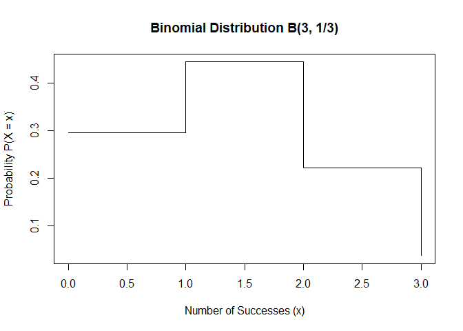
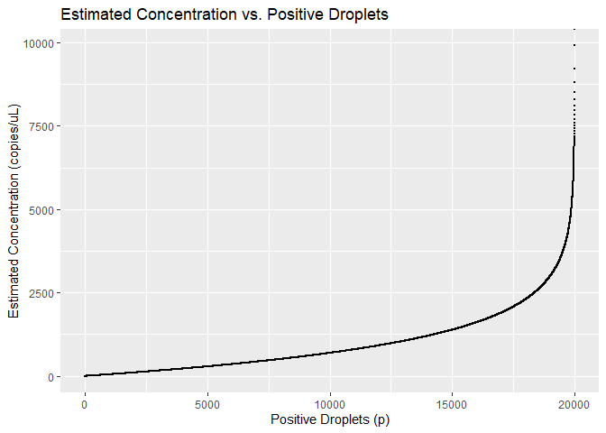
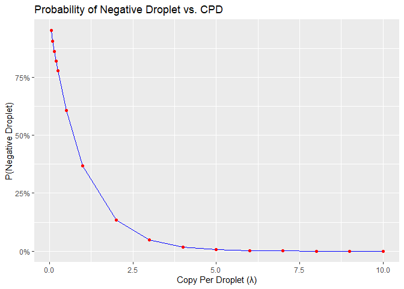
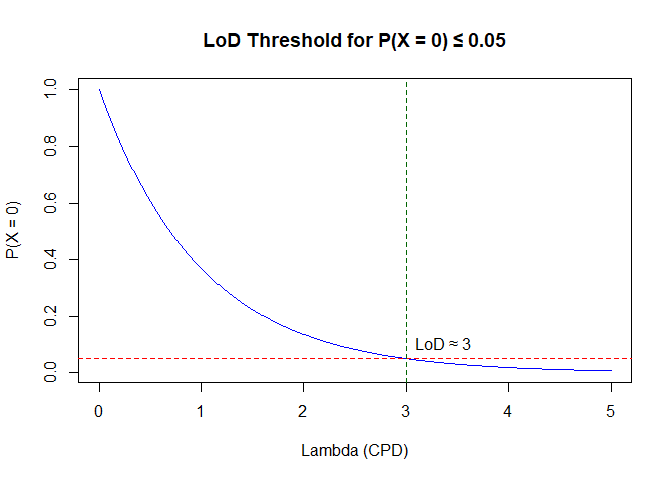

# Introduction to Digital PCR (ddPCR) {.unnumbered}

Digital PCR (**ddPCR**) is a cutting-edge, highly sensitive technique that offers a more precise method for measuring nucleic acids compared to traditional quantitative PCR (qPCR).
It works by partitioning a sample into thousands of individual reactions, effectively counting the number of positive and negative droplets that contain specific DNA or RNA sequences.
This method allows for the absolute quantification of genetic material without the need for a standard curve or external calibration, which is typically required in qPCR.
The ability of ddPCR to quantify gene copy numbers without calibration stems from its unique principle of directly counting individual molecules.
Instead of relying on relative changes in fluorescence intensity, ddPCR uses Poisson statistics to determine the exact number of target DNA copies in a sample based on the fraction of droplets that test positive for the target sequence.
This feature makes ddPCR especially valuable in applications where high precision is needed, such as gene expression analysis, rare allele detection, and the measurement of gene copy number variations (**CNVs**).
Furthermore, ddPCR is not influenced by factors such as amplification efficiency, which can often introduce errors in traditional PCR-based methods.
As a result, ddPCR is considered a gold standard for precise, reproducible measurements of gene copy numbers, providing an unparalleled level of accuracy in quantification.

**Poisson Distribution in ddPCR for Quantifying Gene Copy Numbers** 

One of the key mathematical foundations of ddPCR is the application of the **Poisson distribution**, which is used to model the random distribution of target DNA molecules into individual reaction partitions (droplets).
This distribution allows ddPCR to calculate the number of DNA copies present in a sample without a calibration curve, making it an exceptionally accurate and reliable method for quantification.

In ddPCR, a sample is partitioned into thousands of microdroplets, and each droplet undergoes PCR amplification.
The number of droplets that contain the target DNA is recorded, and using the Poisson distribution, the concentration of the target DNA can be calculated.
The Poisson distribution models the probability of a given number of occurrences (in this case, the number of DNA molecules) within a fixed interval (the volume of each droplet), assuming the events (molecules of DNA) happen independently and randomly.
The formula for the Poisson distribution is:

$$ P(k)= e^{-\lambda} \cdot\frac{\lambda^k}{k!}$$

Where:

-   P(k): the probability of observing exactly k target DNA molecules in a droplet

-   $\lambda$: the expected average number of DNA molecules in a droplet which we aim to estimate

-   e: the Euler's number (approximately 2.71828)

-   k: the number of target molecules observed in the droplet

In ddPCR, the target DNA is typically spread across the droplet population, and after PCR amplification, some droplets will contain no copies of the target, while others will contain one copy or even more .
And by counting the number of droplets with zero copies (**negative droplets**) and the number of droplets with one or more copies (**positive droplets)**, ddPCR uses the Poisson distribution to estimate the λ, which represents the number of target DNA molecules per droplet.

The key relationship here is that the fraction of positive droplets can be related to the Poisson-distributed number of target molecules in the sample, allowing for the direct calculation of the absolute concentration of target DNA (or gene copy number) in the original sample, without the need for external standards or calibration.

The Poisson model assumes that the DNA molecules are distributed randomly and independently into droplets.
The number of positive droplets (those that contain at least one copy of the target) and negative droplets (those with no copies of the target) allows for the estimation of the concentration of the target gene in the sample using the following equation:

$$C= -\frac{d}{v}ln(1-\frac{p}{N})$$

Where:

-   N: the number of total droplet

-   p: the number of positive droplet for the target gene

-   v: the volume of a droplet (in micro liter)

-   d: the dilution factor applied to dilute the sample from the stock to the well

This approach allows ddPCR to provide highly accurate, absolute quantification of gene copy numbers in complex samples, even when the target sequence is rare or present in very low quantities, without the need for reference standards or calibration curves.


<!--chapter:end:index.Rmd-->

# Author  {-}

My name is Kyungmin In, and I am the head of the Research Unit at **GCCL** (https://eng.gccl.co.kr/).I have worked as a bioanalytical team leader for many years at several companies. My academic background includes a Ph.D. in molecular biology, with additional studies in immunology. During my Ph.D. in Germany, I focused on researching rare genetic diseases. I am particularly interested in automation and reproducible data generation and analysis for bioanalysis, which has led me to explore tools like **R**. Additionally, I have experience using commercial systems like **Watson LIMS** (Thermo Fisher Scientific) for efficient data management and analysis, in line with the company's goals."


<!--chapter:end:00-Authour.Rmd-->

# Chapter 1: Bernoulli Trial {.unnumbered}

A Bernoulli trial is a random experiment where there are only two possible outcomes: **success** or **failure**.\
The probability of success is denoted by $p$, and the probability of failure is $1 - p$.

To make this concept intuitive, imagine a game where you roll a fair six-sided die.\
You win a prize if the number is a multiple of 3, which includes 3 and 6.\
There are two favorable outcomes out of six:\
$$
p = \frac{2}{6} = \frac{1}{3}
$$

Let $X$ be a random variable that represents the outcome of a Bernoulli trial:

-   $X = 1$ if the outcome is a success

-   $X = 0$ if the outcome is a failure

The probability mass function (PMF) of $X$ is:

$$
P(X = x) = p^x (1 - p)^{1 - x}, \quad x \in \{0, 1\}
$$

**Example Calculation**: 

Let $p = \frac{1}{3}$

-   $P(X = 1) = \left(\frac{1}{3}\right)^1 \cdot \left(\frac{2}{3}\right)^0 = \frac{1}{3}$
-   $P(X = 0) = \left(\frac{1}{3}\right)^0 \cdot \left(\frac{2}{3}\right)^1 = \frac{2}{3}$

**In R**:


``` r
p <- 1/3
c(success = p, failure = 1 - p)
```

```
##   success   failure 
## 0.3333333 0.6666667
```

A Bernoulli trial is the foundation for many other distributions in probability theory, including the binomial distribution, which models multiple independent Bernoulli trials.

In the context of ddPCR, each droplet behaves like a Bernoulli trial: it either contains one or more copies of the target DNA (success), or it contains none (failure).

<!--chapter:end:01-BernoulliTrial.Rmd-->

# Chapter 2: Binomial Distribution {.unnumbered}

A binomial distribution describes the number of successes in a fixed number of independent Bernoulli trials, each with the same probability of success $p$.

We write: 
$$
X \sim B(n, p)
$$

where:

-   $n$ is the number of trials (e.g., number of droplets in ddPCR),

-   $p$ is the probability of success in each trial,

-   $X$ is the number of successful trials (positive droplets).

**Example**

Let’s consider a simple example using dice. Suppose we roll a die 3 times and count how many times we get a multiple of 3 (i.e., 3 or 6).

This is a Bernoulli trial repeated 3 times, with:

$$
p = \frac{2}{6} = \frac{1}{3}, \quad n = 3
$$

We are interested in the distribution of $X$ = number of successes (i.e., times we get a 3 or 6).

The binomial probability mass function is:

$$
P(X = x) = \binom{n}{x} p^x (1 - p)^{n - x}
$$

**R Example**: Computing Probabilities


``` r
x <- 0:3
px <- dbinom(x, size = 3, prob = 1/3)
px
```

```
## [1] 0.29629630 0.44444444 0.22222222 0.03703704
```

These correspond to:

$P(X = 0)$ = 0.296 (no successes)

$P(X = 1)$ = 0.444 (one success)

$P(X = 2)$ = 0.222 (two successes)

$P(X = 3)$ = 0.037 (all three are successes)

**Visualizing the Binomial Distribution**


``` r
plot(x, px, type = "s",
     xlab = "Number of Successes (x)",
     ylab = "Probability P(X = x)",
     main = "Binomial Distribution B(3, 1/3)")
```

<div class="figure">

<p class="caption">(\#fig:unnamed-chunk-3)binominal distribution</p>
</div>

**Interpretation in ddPCR**

In ddPCR, each droplet is a Bernoulli trial: either positive or negative for the target DNA.\
When considering multiple droplets, the total number of positive droplets follows a binomial distribution.\
This distribution becomes particularly useful when modeling the number of positive droplets across many replicates,\
before transitioning to Poisson-based modeling for rare events.

<!--chapter:end:02-BinomalDistribution.Rmd-->

# Chapter 3: Poisson Distribution {.unnumbered}

The **Poisson distribution** models the probability of a given number of events occurring in a fixed interval of time or space, assuming that the events occur independently and at a constant average rate.

The probability mass function is:

$$
P(X = k) = \frac{e^{-\lambda} \cdot \lambda^k}{k!}, \quad k = 0, 1, 2, ...
$$

Where:

-   $X$ is the number of events (e.g., target copies per droplet),\
-   $\lambda$ is the average number of events per interval (copy per droplet in ddPCR),\
-   $e$ is Euler’s number, approximately 2.71828.

**When to Use the Poisson Distribution**

Poisson distribution is appropriate under the following conditions:

-    Events are rare and occur independently.

-   The probability of two or more events happening simultaneously is negligible.

-   The average event rate ($\lambda$) is constant.

-   The number of possible trials is large, and the success probability is small.

**Poisson Approximation to Binomial**

When:

-   $n$ is large (e.g., \> 20),

-   $p$ is small (e.g., \< 0.01), and

-   $\lambda = n \cdot p$ is moderate (e.g., ≤ 5),

Then the binomial distribution $B(n, p)$ can be approximated by a poisson distribution with parameter $\lambda = np$.

**Example 1**: Rare Event Detection 

Probability that at least 4 sets of triplets are born, assuming a triplet birth probability of 0.0001 and 10,000 births:

**In R**:


``` r
lambda <- 10000 * 0.0001  # λ = np = 1
1 - ppois(3, lambda)       # P(X ≥ 4)
```

```
## [1] 0.01898816
```

**Example 2**: Defective Products

If 2% of products are defective, and we sample 100 products, what is the probability that exactly 3 are defective?


``` r
lambda <- 100 * 0.02
dpois(3, lambda)
```

```
## [1] 0.180447
```

**Example 3**: Typos on a Page

If the number of typos per page follows Poisson(λ = 1), what's the probability of at least one typo?


``` r
1 - dpois(0, 1) 
```

```
## [1] 0.6321206
```

**Example 4**: No Accidents Today 

If the average number of accidents per day on a highway is λ = 3, the probability of no accidents today is:


``` r
dpois(0, 3)
```

```
## [1] 0.04978707
```

**Interpretation in ddPCR** 

In ddPCR, the number of target molecules per droplet follows a Poisson distribution with parameter $\lambda$. This is because each droplet is randomly and independently assigned zero or more DNA molecules. The key relationship used in ddPCR is:

$$
P(\text{no target  in  droplet}) = P(X=0) = e^{-\lambda}
$$ Which leads to the estimate:

$$
\lambda = -ln(\frac{\text{number of negative droplets}}{\text{total number of droplets}})
$$

This formula forms the foundation of **absolute quantification** in ddPCR, as we will explore in the next chapter.

<!--chapter:end:03-PoissonDistribution.Rmd-->

# Chapter 4: Estimating Copy Number in ddPCR {.unnumbered}

Digital PCR (ddPCR) partitions a reaction mix into thousands of droplets, each acting as an independent PCR microreaction.\
The goal is to estimate the **absolute concentration** of the target gene in the original sample, based on how many droplets are **positive** (i.e., contain at least one copy of the target sequence).

**Key Parameters**

-   $N$: total number of droplets\
-   $p$: number of positive droplets (detected signal)\
-   $v$: volume of a single droplet (in μL)\
-   $d$: dilution factor (from original sample to the PCR well)

**Estimating Copy Per Droplet (CPD)**

From Poisson theory, the probability that a droplet is negative (i.e., contains no target) is:

$$
P(X = 0) = e^{-\lambda}
$$

Rearranging:

$$
\lambda = -\ln\left(\frac{N - p}{N}\right) = -\ln\left(1 - \frac{p}{N}\right)
$$

This $\lambda$ is the **mean copy number per droplet**.

**Estimating Concentration (copies/μL)** 

We can convert copy per droplet (CPD) into **concentration** using the droplet volume $v$ and dilution factor $d$:

$$
C = \frac{\lambda \cdot d}{v} = -\frac{d}{v} \ln\left(1 - \frac{p}{N}\right)
$$

This gives the **absolute concentration (copies/μL)** in the original sample.

**Example 1**: Moderate Concentration 

-   Reaction volume: 20 μL\
-   Total droplets: 20,000\
-   Positive droplets: 200\
-   No dilution ($d = 1$)


``` r
N <- 20000
p <- 200
v <- 20 / N
d <- 1
lambda <- -log(1 - p / N)
C <- lambda * d / v
paste(round(C, 3), "copies/uL")
```

```
## [1] "10.05 copies/uL"
```

**Example 2**: Rare Target Detection  

Only 1 positive droplet observed among 20,000:  


``` r
p <- 1
lambda <- -log(1 - p / N)
C <- lambda / v
paste(round(C, 3), "copies/uL")
```

```
## [1] "0.05 copies/uL"
```
**Visualizing Positive Droplets vs. Concentration**  


``` r
library(ggplot2)

result <- data.frame(p.drop = 1:20000)
result$conc <- round(-1 / (20 / 20000) * log(1 - result$p.drop / 20000), 3)

ggplot(result, aes(x = p.drop, y = conc)) +
  geom_point(size = 0.1) +
  labs(title = "Estimated Concentration vs. Positive Droplets",
       x = "Positive Droplets (p)",
       y = "Estimated Concentration (copies/uL)")
```

<div class="figure">

<p class="caption">(\#fig:unnamed-chunk-10)Estimiated concentration vs positive droplet</p>
</div>

**Summary**  

-   ddPCR uses the fraction of positive droplets to estimate $\lambda$  
-   $\lambda$ is then converted to copies per μL  
-   This method requires no standard curve, unlike qPCR  
-   Particularly useful for low copy number detection and absolute quantification

In the next chapter, we will explore how $\lambda$ relates to detection probability and how it informs **Limit of Detection (LoD)** and **Confidence Intervals** in ddPCR.


<!--chapter:end:04-CopyNumberEstimation.Rmd-->

# Chapter 5: CPD and Detection Probability {.unnumbered}

Once we estimate the **mean number of target copies per droplet** ($\lambda$), we can use the **Poisson distribution** to explore how the number of positive droplets is related to the actual concentration.

This chapter focuses on how **copy per droplet (CPD)** affects the probability of detecting the target DNA, particularly when the concentration is low.

**Poisson Probabilities for Different $k$ Values** 

Let’s consider $\lambda = 0.25$ (i.e., 0.25 copies per droplet), and a total of $n = 20,000$ droplets.

We compute the expected number of droplets with 0, 1, 2, ... copies using the Poisson formula:

$$
P(X = k) = \frac{e^{-\lambda} \lambda^k}{k!}
$$


``` r
options(scipen = 1)
lambda <- 0.25
N <- 20000
k <- 0:5
expected <- dpois(k, lambda) * N
data.frame(k, expected)
```

```
##   k      expected
## 1 0 15576.0156614
## 2 1  3894.0039154
## 3 2   486.7504894
## 4 3    40.5625408
## 5 4     2.5351588
## 6 5     0.1267579
```

Result:

| k   | Expected Droplets |
|-----|-------------------|
| 0   | 15,576            |
| 1   | 3,894             |
| 2   | 487               |
| 3   | 41                |
| 4   | 2.5               |
| 5   | 0.13              |

Most droplets are expected to contain 0 or 1 copy, confirming that low-λ conditions result in sparse detection.

**Probability of a Negative Droplet vs. CPD**

We can also explore how the probability of a negative droplet ($P(X = 0)$) decreases as CPD ($\lambda$) increases:


``` r
cpd.list <- c(0.05, 0.1, 0.15, 0.2, 0.25,
              0.5, 1, 2, 3, 4, 5, 6, 7, 8, 9, 10)

prob <- round(exp(-cpd.list), 7)
df_prob <- data.frame(CPD = cpd.list,
                      P_negative = prob)

df_prob
```

```
##      CPD P_negative
## 1   0.05  0.9512294
## 2   0.10  0.9048374
## 3   0.15  0.8607080
## 4   0.20  0.8187308
## 5   0.25  0.7788008
## 6   0.50  0.6065307
## 7   1.00  0.3678794
## 8   2.00  0.1353353
## 9   3.00  0.0497871
## 10  4.00  0.0183156
## 11  5.00  0.0067379
## 12  6.00  0.0024788
## 13  7.00  0.0009119
## 14  8.00  0.0003355
## 15  9.00  0.0001234
## 16 10.00  0.0000454
```

Example values:

| CPD (λ) | P(Negative Droplet) |
|---------|---------------------|
| 0.05    | 0.9512294           |
| 0.25    | 0.7788008           |
| 1       | 0.3678794           |
| 3       | 0.0497871           |
| 5       | 0.0067379           |
| 10      | 0.0000454           |

**Visualization** 


``` r
library(ggplot2)

ggplot(df_prob, aes(x = CPD, y = P_negative)) +
  geom_line(color = "blue") +
  geom_point(color = "red") +
  scale_y_continuous(labels = scales::percent) +
  labs(title = "Probability of Negative Droplet vs. CPD",
       x = "Copy Per Droplet (λ)",
       y = "P(Negative Droplet)")
```

<div class="figure">

<p class="caption">(\#fig:unnamed-chunk-13)Probability of negative droplet vs cpd</p>
</div>

We also can define the **Limit of Detection (LoD)** as the lowest CPD (λ) where the probability of a negative droplet falls below a threshold (e.g., 5%).


``` r
alpha <- 0.05  # maximum acceptable false negative probability
lambda_seq <- seq(0, 5, by = 0.01)
p0 <- exp(-lambda_seq)
lod_lambda <- lambda_seq[which(p0 <= alpha)[1]]
lod_lambda
```

```
## [1] 3
```

This means that at least 3 copies per droplet are needed to ensure that the probability of getting no signal at all is below 5%.


``` r
plot(lambda_seq, p0, type = "l", col = "blue",
     ylab = "P(X = 0)", xlab = "Lambda (CPD)",
     main = "LoD Threshold for P(X = 0) ≤ 0.05")
abline(h = alpha, col = "red", lty = 2)
abline(v = lod_lambda, col = "darkgreen", lty = 2)
text(lod_lambda, alpha + 0.05, paste0("LoD ≈ ", lod_lambda), pos = 4)
```

<div class="figure">

<p class="caption">(\#fig:unnamed-chunk-15)lod threshold</p>
</div>

**Interpretation**

-   When $\lambda$ is small (e.g., 0.05), almost all droplets are negative.\
-   As $\lambda$ increases, the probability of a droplet containing at least one copy increases rapidly.\
-   At $\lambda = 3$, only \~5% of droplets are negative.

This relationship is critical when defining detection thresholds.

**Application to ddPCR LoD**

One way to define Limit of Detection (LoD) is to set a minimum $\lambda$ such that:

$$  
P(\text{No Detection}) = P(X=0) ≤ \alpha
$$ For example:

If we define $\alpha = 0.05$, then LoD occurs around $\lambda = 3$.

**Summary**  

-   The Poisson model connects CPD with the likelihood of detecting target molecules.

-   This is essential for **designing sensitive assays**, particularly when working with **low-abundance targets**.

-   Next, we will explore how to calculate **confidence intervals** for $\lambda$ and the resulting copy number.

<!--chapter:end:05-CPDandDetectionProbability.Rmd-->

# Chapter 6: Confidence Intervals and Limit of Detection (LoD) {.unnumbered}

In ddPCR, it is important not only to estimate the concentration of the target gene, but also to quantify the **uncertainty** of that estimate. This is typically done by calculating **confidence intervals (CIs)** for the estimated copy number.

**Confidence Interval for Proportion of Positive Droplets**

Let:

-   $N$: total number of droplets

-   $p$: number of positive droplets

Then the observed proportion is:

$$
\hat{p} = \frac{p}{N}
$$

The confidence interval for this proportion can be calculated using binomial methods, such as:

-   **Wald method** (simplest, but less accurate when $p$ is near 0 or 1)\
-   **Wilson score interval**\
-   **Exact (Clopper-Pearson) method**

We can then transform this interval into a CI for $\lambda$ (CPD), and then into concentration.

**R Example**: Using `binom` Package


``` r
library(binom)
```

```
## Warning: package 'binom' was built under R version 4.4.3
```

``` r
N <- 20000
p <- 200
p_hat <- p / N

binom.confint(p, N, methods = "exact")
```

```
##   method   x     n mean       lower      upper
## 1  exact 200 20000 0.01 0.008667639 0.01147755
```

This gives the lower and upper bounds for the proportion of positive droplets.

We then compute:


``` r
lambda_lower <- -log(1 - 0.008589)
lambda_upper <- -log(1 - 0.010316)

v <- 20 / N  # droplet volume
d <- 1       # no dilution
conc_lower <- lambda_lower * d / v
conc_upper <- lambda_upper * d / v

round(c(conc_lower, conc_upper), 2)
```

```
## [1]  8.63 10.37
```

**Interpretation**

-   The estimated concentration is about **10.05 copies/μL**

-   The 95% confidence interval is roughly **[8.6, 10.8] copies/μL**

-   The uncertainty reflects both the number of positive droplets and the total droplet count

**Defining Limit of Detection (LoD)**

**LoD** is often defined as the lowest concentration that gives a statistically significant number of positive droplets, with an acceptably low false negative rate.

A common approach is:

-   Simulate or calculate the probability of detecting at least one positive droplet at a given $\lambda$
-   Require that this probability exceeds 1 - α, e.g., 95%

This was demonstrated in the previous chapter using:

$$
P(X=0) = e^{-\lambda}, \ \lambda_{LOD} = -ln(\alpha)
$$

**Summary** 

-   Confidence intervals for ddPCR results can be constructed by first computing the CI for the proportion of positive droplets.
-   The LoD can be estimated as the smallest concentration that still results in a sufficiently high probability of detection.

This closes the foundational mathematical modeling of ddPCR.

<!--chapter:end:06-ConfidenceIntervalandLOD.Rmd-->

# Chapter 7: Applications of ddPCR in Genomic Analysis {.unnumbered}

Digital PCR (ddPCR) enables absolute quantification of nucleic acids without the need for calibration curves.\
This makes it a powerful tool in genomic applications where precision is critical, such as:

-   **Copy Number Variation (CNV) detection**
-   **Rare allele or mutation detection**

**Copy Number Variation (CNV) Detection** 

**Copy Number Variation (CNV)** refers to a gain or loss of gene copies in the genome.
ddPCR quantifies the number of gene copies in a sample and compares it to a **reference gene** with known normal copy number (usually 2).

The relative copy number is calculated as:

$$
\text{Copy Ratio} = \frac{\text{Target Gene Concentration}}{\text{Reference Gene Concentration}}
$$

**Example**:


``` r
target <- 10.1 # estimated concentration of target gene (copies/μL)
reference <- 5.0 # estimated concentration of reference gene (copies/μL)
copy_ratio <- target / reference
round(copy_ratio, 2)
```

```
## [1] 2.02
```

**Interpretation**

| Copy Ratio | Interpretation        |
|------------|-----------------------|
| \~1.0      | Normal diploid copy   |
| \~0.5      | Heterozygous deletion |
| \~2.0      | Gene duplication      |

ddPCR is especially useful for detecting subtle CNVs that may not be distinguishable by qPCR or arrays.  


**Rare Allele Detection** 

ddPCR can detect low-frequency mutations, even at < 0.1% mutant allele frequency (MAF). This is crucial for applications such as:

-   Detecting resistance mutations in cancer (e.g., EGFR T790M)
-   Tracking minimal residual disease (MRD)
-   Analyzing circulating tumor DNA (ctDNA)

**Dual-probe strategy**

Each droplet is tested for both:

-   Wild-type (WT) using one probe (e.g., HEX)
-   Mutant (MT) using another probe (e.g., FAM)
-   The Mutant Allele Frequency (MAF) is calculated as:

$$
\text{MAF} = \frac{\text{Mutanat Copies}}{\text{Mutant Copies + Wild-Type Copies}}
$$

**Example**:


``` r
mutant <- 6
wt <- 994

maf <- mutant / (mutant + wt)
round(maf * 100, 3)
```

```
## [1] 0.6
```

This demonstrates ddPCR’s ability to detect rare mutations in a background of wild-type DNA.

**Summary**

| Application           | Measurement                     | ddPCR Advantage                                  |
| --------------------- | ------------------------------- | ------------------------------------------------ |
| CNV Detection         | Copy ratio (Target / Reference) | Absolute quantification without a standard curve |
| Rare Allele Detection | Mutant Allele Frequency (MAF)   | Sensitive detection of <0.1% MAF                 |


<!--chapter:end:07-Application.Rmd-->

# Chapter 8: Quality Control and Best Practices in ddPCR {.unnumbered}

While digital PCR (ddPCR) provides highly precise quantification, ensuring data quality requires careful experimental design, appropriate controls, and post-run validation.  
This chapter outlines essential quality control (QC) considerations and best practices to ensure reliable and reproducible ddPCR results.

**1. Droplet Quality and Thresholding**
-   **Minimum Droplet Count**:
    A minimum of **10,000 accepted droplets per well** is recommended for statistically robust quantification.\
    Fewer droplets result in wider confidence intervals and increased error.

-   **Rain Detection**:
    "Rain" refers to droplets with intermediate fluorescence that fall between the positive and negative peaks.\
    These droplets may result from:

    -   Poor probe or primer efficiency
    -   Suboptimal thermal cycling
    -   Sample degradation or inhibition

> Inspection and adjusting thresholds may be necessary.

**2. Controls**

-   **No Template Control (NTC)**:
    Included in every run to monitor contamination.
    Expected result: **0 positive droplets**.

-   **Positive Control**:
    A sample with a known concentration of target DNA, used to confirm assay performance.

-   **Reference Gene Control**:
    In CNV assays, use a **stable reference gene** (e.g., RPP30 or RNaseP) to normalize copy number.

**3. Assessing Reproducibility**

Run **technical replicates** to ensure precision and identify potential outliers.


``` r
replicates <- c(10.2, 10.4, 9.9)
mean(replicates) 
```

```
## [1] 10.16667
```

``` r
sd(replicates) 
```

```
## [1] 0.2516611
```

``` r
cv <- sd(replicates) / mean(replicates) * 100
round(cv, 2) # CV (%) < 10% is ideal
```

```
## [1] 2.48
```

**4. False Positives and False Negatives**

| Error Type | Possible Cause | Mitigation Strategy |
|------------------|-----------------------------|-------------------------|
| False Positive | Contamination, misclassified "rain" droplets | Use strict NTC, adjust threshold |
| False Negative | Poor droplet generation, failed amplification | Increase input DNA, optimize conditions |

> For rare mutation detection, even a single false positive can affect interpretation — validation is essential.

**5. LoD Confirmation via Dilution Series**

To confirm the Limit of Detection (LoD), use a serial dilution of a known template and assess the lowest concentration at which detection is consistent.

-   Run 3 or more replicates per dilution level
-   LoD is typically the lowest level at which all replicates are positive

| Practice             | Recommendation                          |
|----------------------|-----------------------------------------|
| Droplet Count        | \>10,000 per well                       |
| NTC                  | Should have 0 positive droplets         |
| Positive Control     | Include known copy number sample        |
| Replicates           | Use technical duplicates or triplicates |
| Threshold Inspection | Adjust for rain manually if needed      |
| LoD Validation       | Perform dilution series experiments     |

By incorporating these best practices, we can minimize experimental variability, reduce false results, and ensure that ddPCR data are reliable and publication-ready.

<!--chapter:end:08-BestPractice.Rmd-->

# Chapter 9: Conclusion {.unnumbered}

Digital PCR (ddPCR) represents a significant advancement in nucleic acid quantification by enabling absolute measurements without the need for standard curves.\
Through precise partitioning and the application of Poisson statistics, ddPCR offers unparalleled sensitivity and reproducibility in genomic analysis.

In this book, we covered:

-   The mathematical foundation of ddPCR using Bernoulli, Binomial, and Poisson models\
-   How to estimate copy number and concentration from droplet counts\
-   The relationship between copy per droplet (CPD) and detection probability\
-   Methods to calculate confidence intervals and define detection limits\
-   Applications in CNV analysis and rare allele quantification\
-   Quality control strategies to ensure reliable ddPCR results

Whether used for cancer diagnostics, gene dosage analysis, or pathogen detection, ddPCR provides a powerful, robust, and accessible platform for molecular biology.

We hope this resource has provided you with both the theoretical understanding and practical tools to confidently apply ddPCR in your own research or clinical workflows.

<!--chapter:end:09-Conclusion.Rmd-->

